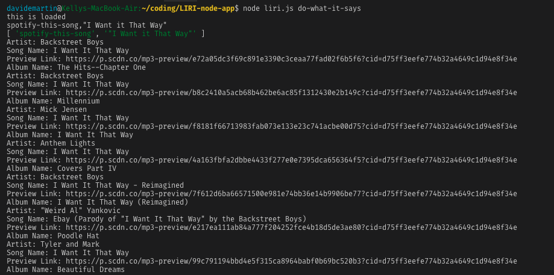
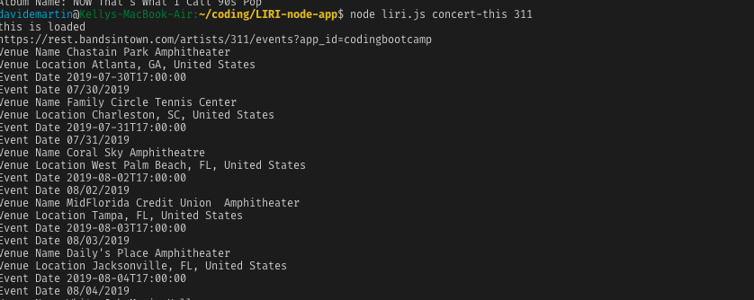
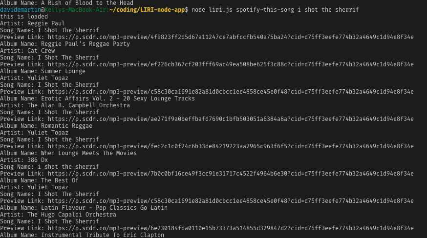
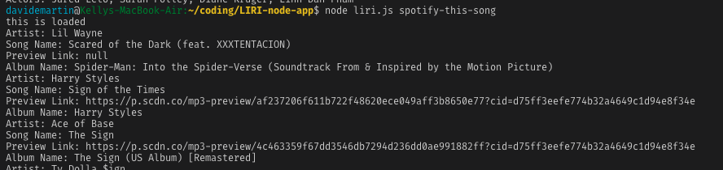
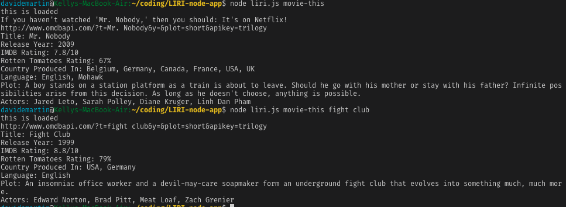

# LIRI-node-app
This app takes in command line arguements and gets results from one of three API's available.
If you pass LIRI, concert-this and a band name it will return results for upcoming concerts and
log the venue name, venue location, and date of the concert. These results are based on the bandsintown API.
If you pass LIRI, spotify-this-song and a song name it will return the artist, song name, spotify preview link, and album name. These results are based on the spotify API.
If you pass LIRI, movie-this and a movie name it will return the title, release year, IMDB rating, Rotten Tomatoes rating, country where it was produced, language, brief plot synopsis, and main actors. 
These results are based on the OMDB API.
The do-what-it-says feature is not yet working but should read the random.txt file and use that data to re-run a command based on what is written in the .txt file.
I have global variables and requirements at the top, followed by a switch case statement that identifies which command action to run, and the the list of functions that return the data and log it to the console.
To run the app the user must be in the active directory in the terminal and type: node liri.js (1 of the 4 actions) (user input).The user input is either the band, song, or movie they wish to search.
I use 3 API's and several node npm packages (including axios, spotify, moment, dotenv).
Screenshots for each action...
,
,
,
,
,
